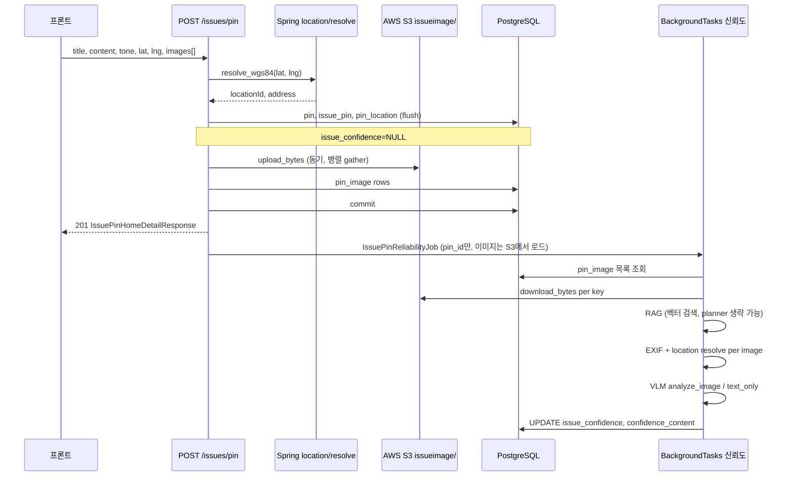

# 이슈 핀 게시·비동기 신뢰도 — 변경 사항 전체 문서

> 브랜치: `fix/53-ai-auto-issue-write`  
> 작성 목적: 이번 작업에서 추가·수정된 **모든** API, 서비스, 모델, 설정, 프롬프트, 운영 이슈를 한 문서에 정리  
> 대상 독자: 백엔드·프론트·QA·운영

---

## 목차

1. [요약](#1-요약)
2. [배경 및 설계 원칙](#2-배경-및-설계-원칙)
3. [전체 흐름도](#3-전체-흐름도)
4. [API 명세](#4-api-명세)
5. [응답 DTO 및 상태 값](#5-응답-dto-및-상태-값)
6. [동기 게시 경로 (POST /issues/pin)](#6-동기-게시-경로-post-issuespin)
7. [비동기 신뢰도 파이프라인](#7-비동기-신뢰도-파이프라인)
8. [confidence_content (시민용 근거 문구)](#8-confidence_content-시민용-근거-문구)
9. [환경 변수 (.env)](#9-환경-변수-env)
10. [데이터베이스](#10-데이터베이스)
11. [신규 파일 목록 및 역할](#11-신규-파일-목록-및-역할)
12. [수정 파일 목록 및 변경 내용](#12-수정-파일-목록-및-변경-내용)
13. [Gemini 재시도·Fallback·타임아웃](#13-gemini-재시도fallback타임아웃)
14. [로깅 가이드](#14-로깅-가이드)
15. [에러·성공 코드](#15-에러성공-코드)
16. [의존성 (requirements.txt)](#16-의존성-requirementstxt)
17. [프론트엔드 연동 체크리스트](#17-프론트엔드-연동-체크리스트)
18. [트러블슈팅 (운영에서 겪은 이슈)](#18-트러블슈팅-운영에서-겪은-이슈)
19. [미구현·향후 작업](#19-미구현향후-작업)
20. [변경 파일 인덱스 (전체)](#20-변경-파일-인덱스-전체)

---

## 1. 요약

| 구분 | 내용 |
|------|------|
| **핵심 기능** | 이슈 핀 **실제 게시** (`POST /issues/pin`), **상세 조회**, **신뢰도 폴링** |
| **미리보기** | 기존 `POST /issues/pin/ai` 유지 (DB 저장 없음, AI 문구만) |
| **게시 정책** | 신뢰도가 낮아도 **항상 201** — `ISSUE_4221`로 게시 거절 **하지 않음** |
| **이미지** | 0~N장, S3 `issueimage/` 경로, **동기 업로드** 후 201 |
| **신뢰도** | **비동기** VLM + RAG → `issue_pin.issue_confidence`, `confidence_content` UPDATE |
| **근거 문구** | 일반 시민이 읽는 한국어 bullet, 줄바꿈 `\n` 유지 |
| **S3 ↔ 신뢰도** | 백그라운드는 **메모리 스냅샷이 아니라 DB `pin_image` → S3 다운로드** 로 이미지 로드 |
| **일일 사용 제한** | Redis, KST 자정 리셋 — AI 생성·게시(uid) / 수정(pin_id), **성공 시에만** 카운트 |

---

## 2. 배경 및 설계 원칙

### 2.1 사용자 여정 (2단계)

1. **미리보기**: `POST /issues/pin/ai` → AI가 제안한 `title` / `content`
2. **편집**: 프론트에서 사용자가 문구 수정
3. **게시**: `POST /issues/pin` → 최종 문구·좌표·(선택) 이미지 저장
4. **폴링**: `GET /issues/pin/{pin_id}/reliability` 또는 상세 API로 신뢰도 완료 확인

### 2.2 서버가 하지 않는 일

- 게시 시 핀 LLM으로 문구 **재작성하지 않음** (`_tune_title` 등 미사용)
- 게시 API에서 `/pin/ai` **다시 호출하지 않음**
- 신뢰도 낮다고 게시 **거절하지 않음** (`ISSUE_4221` 미사용)

### 2.3 서버가 하는 일

- 최종 `title` / `content`를 **strip·길이 검증만** 하고 `pin`에 저장
- Spring 코어 `GET /api/location/resolve`로 `location_id`, `detail_address` 확보
- 이미지 S3 업로드 + `pin_image` INSERT (**동기**)
- `issue_pin_state = BEFORE_PROGRESS` 로 생성
- 백그라운드에서 신뢰도 분석 후 `issue_confidence`, `confidence_content` UPDATE

### 2.4 S3 동기화 변경의 이유 (중요)

**초기 설계**: S3 업로드를 백그라운드에서 처리하고, 같은 작업 안에서 VLM까지 수행.

**변경 후**: 사용자 요청으로 S3·`pin_image` 저장을 **동기(201 전)** 로 이동.

**발생했던 문제**: 백그라운드 신뢰도만 요청 시점 **메모리 스냅샷**에 의존 → `BackgroundTasks`·긴 바이트 배열·Gemini 503 재시도와 겹치며 `confidence_content`가 **NULL**로 남는 사례 다수.

**해결**: 백그라운드는 **`pin_image.pin_s3_key` → `S3Util.download_bytes`** 로 이미지를 다시 읽은 뒤 VLM에 전달. S3 업로드가 끝난 뒤에만 신뢰도 job이 의미 있게 동작.

### 2.5 일일 사용 제한 (rate limit)

Gemini·DB 부하 방지를 위해 아래 API에 **일일 성공 횟수 제한**을 둡니다 (`IssuePinDailyRateLimitService`, Redis).

| API | 제한 단위 | 카운트 시점 |
|-----|-----------|-------------|
| `POST /issues/pin/ai` | **uid** / 일 | LLM 성공 후 |
| `POST /issues/pin` | **uid** / 일 | DB commit 성공 후 |
| `PATCH /issues/pin/{pin_id}` | **pin_id(글)** / 일 | DB commit 성공 후 |

- **리셋**: KST 자정 (`resetAt`은 다음 자정 ISO8601)
- **실패 미집계**: LLM 실패, 검증 실패, DB 롤백 시 Redis INCR 없음
- **429**: 한도 초과 시에만 (`AI_4291`, `ISSUE_4291`, `ISSUE_4292`)
- **ON/OFF**: env `*_RATE_LIMIT_ENABLED=false`면 해당 kind만 비활성 (assert·record·429 미적용)
- **Redis 미연결**: fail-open(제한 스킵) + warning 로그
- **성공 응답**: 기존 `result` 유지 + **`rateLimitQuota`** 필드 additive (프론트 선택 사용)
- **사전 조회**: `GET /issues/pin/ai/quota`, `create/quota`, `edit/quota?pin_id=`

---

## 3. 전체 흐름도

### 3.1 게시 + 신뢰도 (현재 구현)



### 3.2 신뢰도 파이프라인 단계

| 순서 | 단계 | 타임아웃(기본) | 설명 |
|------|------|----------------|------|
| 1 | RAG | 45초 | planner 생략 시 title+content로 벡터 검색만 |
| 2 | S3 | (전체 한도 내) | `pin_image` 행 기준 S3 다운로드 |
| 3 | EXIF | (전체 한도 내) | 사진별 EXIF → 코어 주소 resolve |
| 4 | VLM | 150초 | 이미지 있으면 `analyze_image`, 없으면 `analyze_text_only` |
| 5 | PERSIST | - | 점수 + 시민용 `confidence_content` 저장 |
| - | **전체** | **240초** | 초과 시 실패 문구 저장 (`score=0.0`) |

---

## 4. API 명세

공통: `Authorization: Bearer {token}` (또는 쿠키), prefix `/issues`

### 4.1 `GET /issues/tone-types`

톤 enum 목록.

**응답 예**: `[{ "key": "NONE", "label": "없음" }, ...]`

---

### 4.2 `POST /issues/pin/ai` (기존, 유지)

AI 미리보기. **DB 저장 없음.**

| Form 필드 | 필수 | 설명 |
|-----------|------|------|
| title | O | 초안 제목 |
| content | O | 초안 본문 |
| tone | X | 기본 `없음` (한국어 value) |
| latitude | O | 위도 |
| longitude | O | 경도 |

**처리**: 작업 전 `assert_daily_quota_available(AI)` → RAG planner → 벡터 검색 → `IssuePinLLMService` → LLM 성공 시 `record_daily_quota_success(AI)`

**성공 응답**: 기존 AI 필드 + `rateLimitQuota` (`enabled`, `dailyLimit`, `usedCount`, `remainingCount`, `resetAt`)

**에러 코드**

| code | HTTP | 상황 |
|------|------|------|
| `AI_4291` | 429 | uid 일일 AI 생성 성공 횟수 초과 |

429 `result` 예: `{ dailyLimit, usedCount, resetAt }` (pinId 없음)

---

### 4.3 `POST /issues/pin` (신규 핵심)

실제 게시. **multipart/form-data** — `request`(JSON part) + `photos`(선택).

| 파트 | 필수 | 설명 |
|------|------|------|
| `request` | O | JSON. `lat`, `lng`, `pinTitle`, `pinContent`, `pinImages[]` |
| `photos` | X | 이미지 파일 0~5장 (합계 50MB) |

**`request` JSON**

| 필드 | 필수 | 설명 |
|------|------|------|
| `lat` | O | 위도 (-90~90) |
| `lng` | O | 경도 (-180~180) |
| `pinTitle` | O | **최종** 제목 |
| `pinContent` | O | **최종** 본문 |
| `pinImages` | O | `{ isMain }[]` — `photos`와 동일 길이 (0장이면 `[]`) |

- **`toneType` 미수신** → DB `ToneType.NONE` 고정
- `photos` ↔ `pinImages[]` 인덱스 1:1, `isMain` 합산 정확히 1개(이미지 1장 이상 시)
- S3 업로드 후 DB/commit 실패 시 신규 S3 객체 롤백 삭제 시도

**HTTP**: `201 Created`  
**성공 코드**: `ISSUE_PIN_IMPORT_201`  
**응답 body**: `IssuePinHomeDetailResponse` (camelCase, Spring 홈 상세 형태)

**에러 코드**

| code | HTTP | 상황 |
|------|------|------|
| `ISSUE_PIN_IMPORT_400_1` | 400 | 필수값/개수/isMain 검증 실패 |
| `ISSUE_PIN_IMPORT_400_2` | 400 | 역지오코딩·DB 저장 실패 |
| `PIN_IMAGE_400_1` | 400 | photos 합계 50MB 초과 |
| `PIN_IMAGE_400_2` | 400 | 업로드/검증/S3 실패 |
| `PIN_IMAGE_400_3` | 400 | 5장 초과 |
| `USER_4041` | 404 | 사용자 없음 |
| `ISSUE_4291` | 429 | uid 일일 게시 성공 횟수 초과 |

**성공 응답**: `IssuePinHomeDetailResponse` + `rateLimitQuota`

**동기 처리 순서** (`IssueService.create_issue_pin`):

0. `assert_daily_quota_available(CREATE)` (uid)
1. payload 검증 (제목/본문, photos↔pinImages, isMain, 5장/50MB)
2. 사용자 존재 확인
3. `LocationResolveClient.resolve_wgs84` → 실패 시 `ISSUE_PIN_IMPORT_400_2`
4. `_snapshot_update_photos` — multipart → `ImageSnapshot(bytes)`
5. `Pin` INSERT (`tone_type=NONE`)
6. `IssuePin` INSERT (`issue_confidence=None`, `confidence_content=None`, `BEFORE_PROGRESS`)
7. `PinLocation` INSERT (`location_id`, `detail_address`, `pin_point` WKT)
8. `_upload_new_pin_images_with_is_main` — S3 + `pin_image` (`isMain` per `pinImages`)
9. `commit` (실패 시 S3 롤백) → 성공 시 `record_daily_quota_success(CREATE)`
10. `IssuePinBackgroundRunner.schedule(job, background_tasks=...)`
11. 홈 상세 응답 조립 (`reliabilityStatus=pending`) + `rateLimitQuota`

---

### 4.4 `GET /issues/pin/{issue_pin_id}`

핀 홈 상세.

**성공 코드**: `ISSUE_2001`  
**응답**: `IssuePinHomeDetailResponse`

**로딩**: `IssuePinRepo.get_by_issue_pin_id` + `selectinload(pin, pin_images, pin_location, user)`

---

### 4.5 `GET /issues/pin/{pin_id}/reliability`

신뢰도 전용 폴링.

**성공 코드**: `ISSUE_2002`  
**응답**: `IssuePinReliabilityResponse`

| 필드 | 설명 |
|------|------|
| issueConfidence | 0.0~1.0 또는 null (분석 전) |
| confidenceContent | 시민용 markdown bullet 문자열 |
| reliabilityStatus | pending / completed / failed |
| imageUploadStatus | none / completed 등 |

---

### 4.6 `PATCH /issues/pin/{pin_id}`

이슈 핀 수정. **multipart/form-data** — `request`(JSON part) + `photos`(선택).

**성공 코드**: `ISSUE_PIN_EDIT_200`  
**응답**: `IssuePinHomeDetailResponse`

**요청**

| 파트 | 필수 | 설명 |
|------|------|------|
| `request` | O | JSON. `pinTitle`, `pinContent`, 선택 `pinImageUrls`, `photos` 있을 때 `pinImages` |
| `photos` | X | 신규 이미지 파일 배열 (최대 5장, 합계 50MB) |

**`request` JSON**

- `pinImageUrls` **생략** + `photos` 없음 → 기존 이미지 유지 (제목/본문만 수정)
- `pinImageUrls: []` → 기존 이미지 전부 삭제
- `pinImageUrls: [{ pinImageUrl, isMain }]` → URL 일치 `pin_image` 행 재사용(`pin_image_id` 유지)
- `photos` ↔ `pinImages[]` 인덱스 1:1, `isMain` 합산 정확히 1개(이미지 1장 이상 시)

**수정 제약**
- 작성자 본인만 수정 (`COMMON_403`)
- `issue_pin_state == BEFORE_PROGRESS`만 수정 (`ISSUE_PIN_EDIT_400_1`)
- **toneType·위도·경도·region 변경 불가** (DB 기존 값 유지)
- `pin.updated_at`은 title/content 변경 시에만 갱신 (이미지만 변경 시 pin row 미갱신)
- S3 업로드 후 DB 실패 시 신규 S3 객체 롤백 삭제 시도

**에러 코드**

| code | HTTP | 상황 |
|------|------|------|
| `ISSUE_PIN_EDIT_400_1` | 400 | 필수값/isMain/개수/URL 검증 실패 |
| `ISSUE_PIN_EDIT_400_2` | 400 | DB 저장 등 처리 실패 |
| `PIN_IMAGE_400_1` | 400 | 신규 photos 합계 50MB 초과 |
| `PIN_IMAGE_400_2` | 400 | 업로드/검증/S3 실패 |
| `PIN_IMAGE_400_3` | 400 | 최종 5장 초과 |
| `USER_4041` | 404 | 사용자 없음 |
| `ISSUE_4292` | 429 | pin_id(글) 일일 수정 성공 횟수 초과 |

429 `result` 예: `{ dailyLimit, usedCount, resetAt, pinId }` — **edit만** `pinId` 포함

**성공 응답**: `IssuePinHomeDetailResponse` + `rateLimitQuota`

**처리**: `assert_daily_quota_available(EDIT, pin_id=…)` → … → commit 성공 후 `record_daily_quota_success(EDIT, pin_id=…)`

**신뢰도 파이프라인**
- 수정 후 `issue_confidence`/`confidence_content` NULL 초기화 + 재스케줄 (기존 GPS는 `pin_location.pin_point`에서 추출)
- 진행 중 job 취소 시도, generation 검증으로 stale 결과 차단

---

### 4.7 quota 조회 (일일 사용 제한)

게시·수정·AI 호출 **전** 남은 횟수 확인용. 인증 필수.

| API | 제한 단위 | 성공 코드 |
|-----|-----------|-----------|
| `GET /issues/pin/ai/quota` | uid | `ISSUE_PIN_AI_QUOTA_GET_SUCCESS` |
| `GET /issues/pin/create/quota` | uid | `ISSUE_PIN_CREATE_QUOTA_GET_SUCCESS` |
| `GET /issues/pin/edit/quota?pin_id=` | pin_id | `ISSUE_PIN_EDIT_QUOTA_GET_SUCCESS` |

edit quota는 `ensure_issue_pin_edit_access`로 **본인 pin**만 조회 가능.

**응답** (`IssuePinQuotaResponse`, camelCase):

```json
{
  "enabled": true,
  "dailyLimit": 10,
  "usedCount": 3,
  "remainingCount": 7,
  "resetAt": "2026-06-04T00:00:00+09:00"
}
```

`enabled: false` (env OFF 또는 `dailyLimit < 1`)일 때: `usedCount: 0`, `remainingCount: dailyLimit`.

---

## 5. 응답 DTO 및 상태 값

### 5.1 `ReliabilityStatus`

| 값 | 의미 |
|----|------|
| `pending` | `issue_confidence`·`confidence_content` 모두 비어 있음 |
| `completed` | 분석 완료 (점수·근거 있음) |
| `failed` | 분석 실패 안내 문구 저장됨 (`FAILED_RELIABILITY_BASIS` 패턴) |

판별: `IssueService._derive_reliability_status` + `is_failed_reliability_content()`

### 5.2 `ImageUploadStatus`

| 값 | 의미 |
|----|------|
| `none` | 이미지 없이 게시 |
| `pending` | (레거시 호환) 이미지 없고 신뢰도 pending |
| `completed` | `pin_image` 1건 이상 |
| `failed` | (예약) |

현재 게시 API는 이미지 있으면 동기 업로드 후 바로 `completed`.

### 5.3 `IssuePinHomeDetailResponse` 주요 필드 (camelCase)

`pinId`, `issuePinId`, `pinTitle`, `pinContent`, `issuePinState`, `pinDetailAddress`, `pinImageUrls[]`, `reliabilityStatus`, `imageUploadStatus`, `issueConfidence`는 상세에 직접 넣지 않고 reliability API 사용 권장.

### 5.4 `rateLimitQuota` / `IssuePinQuotaResponse`

| 필드 | 설명 |
|------|------|
| `enabled` | env로 해당 kind 제한 활성 여부 |
| `dailyLimit` | 일일 허용 성공 횟수 |
| `usedCount` | 오늘(KST) 이미 성공한 횟수 |
| `remainingCount` | `max(0, dailyLimit - usedCount)` (비활성 시 `dailyLimit`) |
| `resetAt` | 다음 KST 자정 (ISO8601) |

- `POST /issues/pin/ai`, `POST /issues/pin`, `PATCH /issues/pin/{pin_id}` **성공** 시 `result` 하단에 포함
- quota GET API 응답 body와 동일 구조

---

## 6. 동기 게시 경로 (`POST /issues/pin`)

### 6.1 이미지 스냅샷

- `_snapshot_update_photos`: `UploadFile.read()` → `ImageSnapshot(data, content_type, filename)`
- 빈 파일·비이미지 MIME·허용 확장자 외 → `PIN_IMAGE_400_2`
- 합계 50MB 초과 → `PIN_IMAGE_400_1`

### 6.2 S3 업로드

- prefix: **`issueimage`** (`S3_ISSUE_IMAGE_PREFIX`)
- 메서드: `S3Util.upload_bytes` (신규)
- 키 형식: `issueimage/{UTC timestamp}-{uuid}{ext}`
- 병렬: `asyncio.gather` per snapshot
- DB: `PinImageRepo.save` — `pin_s3_key`, `pin_s3_url`, `is_main` (`pinImages[].isMain`)
- 구현: `_upload_new_pin_images_with_is_main` (PATCH와 공통)

### 6.3 위치

- `pin_location.location_id` = Spring resolve 응답 `locationId`
- `detail_address` = resolve `address` (최대 150자)
- `pin_point` = `wkt_point_from_wgs84` (`app/utils/geo.py`, SRID 4326)
- 요청 좌표: JSON `lat` / `lng`

### 6.4 tone_type DB 저장

- **등록 API**: `toneType` 미수신 → DB **`NONE`** 고정
- **`POST /issues/pin/ai`**: `ToneType` 한국어 **value** (Form)
- ORM/DB: enum **name** 저장 (`NONE`, `DISCOMFORT_COMPLAINT`, …)
- DB check constraint에 모든 name 허용 필요 (로컬·AWS 각각 마이그레이션 이슈 있었음)

---

## 7. 비동기 신뢰도 파이프라인

구현: `app/services/internal/IssuePinBackgroundRunner.py`

### 7.1 Job 스키마 (`IssuePinReliabilityJob`)

```python
@dataclass
class IssuePinReliabilityJob:
    issue_pin_id: int
    pin_id: int
    title: str
    content: str
    user_gps: str          # "lat,lng" 6자리
    user_address: str | None
```

**주의**: `image_snapshots` 필드 **제거됨** — 이미지는 `pin_id`로 S3에서 로드.

### 7.2 스케줄링

- FastAPI `BackgroundTasks.add_task(run_reliability_job, job)` **우선**
- fallback: `asyncio.create_task` + 모듈 레벨 `_RELIABILITY_PIPELINE_TASKS` set (GC 방지)

### 7.3 단계별 처리

1. **RAG** — `build_rag_context_block_for_reliability`
   - `ISSUE_PIN_RELIABILITY_SKIP_RAG_PLANNER=true`(기본): planner **생략**, `title:{title}\ncontent:{content}` 로 벡터 검색
   - planner 사용 시 Gemini 503 재시도로 **수분** 지연 가능 → 기본 생략 권장

2. **S3** — `_load_snapshots_from_s3(pin_id)`
   - `pin_image` ORDER BY `is_main DESC`, `pin_image_id ASC`
   - `S3Util.download_bytes(pin_s3_key)`

3. **EXIF** — `_build_vlm_inputs_from_snapshots` (이미지별 `asyncio.gather`)
   - `ImageExifLocationResolveService.extract_and_resolve`
   - `ImageWithLocation(image=UploadFile(BytesIO), address=...)`

4. **VLM** — `VLMService.analyze_image` 또는 `analyze_text_only`
   - primary: `GEMINI_VLM_MODEL` (기본 `gemini-2.5-flash`)
   - fallback: `GEMINI_VLM_FALLBACK_MODELS` 중 **1개만** (신뢰도 파이프라인)
   - `max_attempts`: `ISSUE_PIN_RELIABILITY_GEMINI_MAX_ATTEMPTS` (기본 2)

5. **근거 조립** — `resolve_confidence_basis_markdown` → `format_confidence_content_for_user`

6. **저장** — `IssuePinRepo.update_confidence` (SQL `UPDATE`, 별도 `AsyncSessionLocal`)

### 7.4 실패 시

- 예외·타임아웃·VLM 전체 실패 → `finally`에서 `_persist_failure_confidence`
- `issue_confidence = 0.0`
- `confidence_content = FAILED_RELIABILITY_BASIS` (시민용 문구)

---

## 8. confidence_content (시민용 근거 문구)

구현: `app/services/internal/issue_confidence_basis.py`

### 8.1 저장 형식

- Plain text + markdown bullet (`- `)
- 줄바꿈: **실제 `\n` 문자** (JSON 응답 시 `\\n`)
- 요약 한 줄 + bullet 목록

**성공 예시**:

```
제출하신 글·사진·위치 정보가 서로 잘 맞는 편으로 보여요.
- 무엇을 제보하셨는지 글만 봐도 이해하기 쉽습니다.
- 사진에서도 글과 같은 상황이 보입니다.
- 지도에 표시한 위치와 사진을 찍은 곳이 같은 동네 수준으로 보입니다.
```

### 8.2 실패 예시

```
- 지금은 이 제보에 대한 AI 검토 결과를 불러오지 못했어요.
- 잠시 후 다시 열어보시거나, 사진과 글이 잘 보이는지 확인해 주세요.
```

### 8.3 점수 구간별 요약 문장

| score | intro 문장 |
|-------|------------|
| ≥ 0.75 | 제출하신 글·사진·위치 정보가 서로 잘 맞는 편으로 보여요. |
| ≥ 0.45 | 전반적으로 이해하기 쉬운 제보예요. 아래 내용을 함께 참고해 주세요. |
| < 0.45 | 확인이 더 필요해 보이는 제보예요. 아래 내용을 참고해 주세요. |

### 8.4 프롬프트 규칙 (VLM / text-only)

- `app/services/prompts/confidence_basis.py` — `CONFIDENCE_BASIS_PROMPT_BLOCK`
- `app/services/prompts/vlm.py` — 이미지 VLM용 신뢰도 근거 섹션
- `app/services/prompts/issue_reliability_text.py` — 이미지 없을 때

금지: EXIF, RAG, 메타데이터, GPS, 핀, JSON, axis 이름 노출

### 8.5 후처리

- `sanitize_user_facing_basis_text`: **한 줄** 기술 용어 치환 (줄바꿈 유지)
- `normalize_display_line_breaks`: bullet마다 한 줄
- `render_confidence_basis_markdown`: 축 라벨(`제보 내용:`) **표시 안 함**

### 8.6 프론트 표시

`confidenceContent`는 **`\n`을 줄바꿈으로 렌더**해야 함.

- React: `white-space: pre-line` 또는 split `\n`
- Flutter: 문자열 그대로 `Text` with multiline

---

## 9. 환경 변수 (.env)

| 변수 | 기본값 | 설명 |
|------|--------|------|
| `GEMINI_API_KEY` | - | 필수 (VLM·RAG·임베딩) |
| `GEMINI_VLM_MODEL` | `gemini-2.5-flash` | 신뢰도 VLM (3.1-pro는 503·지연 多) |
| `GEMINI_VLM_FALLBACK_MODELS` | `gemini-2.5-flash,gemini-2.5-pro` | 콤마 구분 |
| `GEMINI_PIN_TEXT_MODEL` | `gemini-2.5-flash` | /pin/ai 핀 LLM |
| `GEMINI_PIN_TEXT_FALLBACK_MODELS` | `gemini-2.5-flash-lite,gemini-2.5-flash` | |
| `LOCATION_CORE_BASE_URL` | `http://localhost:8080` | Spring resolve |
| `LOCATION_RESOLVE_TIMEOUT_SECONDS` | `10.0` | |
| `AWS_BUCKET` | - | S3 버킷 |
| `AWS_ACCESS_KEY` / `AWS_SECRET_KEY` / `AWS_REGION` | - | S3 |
| `ISSUE_PIN_MAX_IMAGES` | `5` | 게시당 최대 이미지 |
| `ISSUE_CONFIDENCE_BASIS_MAX_CHARS` | `2000` | 근거 최대 길이 |
| `ISSUE_PIN_RELIABILITY_PIPELINE_TIMEOUT_SECONDS` | `420` | 전체 파이프라인 |
| `ISSUE_PIN_RELIABILITY_SKIP_RAG_PLANNER` | `true` | planner 생략 |
| `ISSUE_PIN_RELIABILITY_GEMINI_MAX_ATTEMPTS` | `2` | 모델당 재시도 |
| `ISSUE_PIN_RELIABILITY_RAG_TIMEOUT_SECONDS` | `120` | RAG 단계 |
| `ISSUE_PIN_RELIABILITY_VLM_TIMEOUT_SECONDS` | `180` | VLM 단계 |
| `PIN_TITLE_MAX_LENGTH` | `100` | |
| `PIN_CONTENT_MAX_LENGTH` | `10000` | |
| `REDIS_LOCAL_HOST` / `REDIS_LOCAL_PORT` | `6379` | local 환경 rate limit (또는 `LOCAL_REDIS_*` → CI에서 alias) |
| `VALKEY_HOST` / `VALKEY_PORT` / `VALKEY_DB` / `VALKEY_PASSWORD` / `VALKEY_TLS` | - | dev/prod Redis(Valkey) |
| `AI_PIN_GENERATION_DAILY_LIMIT` | `10` | uid당 AI 미리보기 일일 성공 허용 |
| `AI_PIN_GENERATION_RATE_LIMIT_ENABLED` | `true` | `false`면 AI 제한 OFF |
| `ISSUE_PIN_CREATE_DAILY_LIMIT` | `10` | uid당 게시 일일 성공 허용 |
| `ISSUE_PIN_CREATE_RATE_LIMIT_ENABLED` | `true` | `false`면 게시 제한 OFF |
| `ISSUE_PIN_EDIT_DAILY_LIMIT` | `10` | pin_id(글)당 수정 일일 성공 허용 |
| `ISSUE_PIN_EDIT_RATE_LIMIT_ENABLED` | `true` | `false`면 수정 제한 OFF |

Redis key 예: `issue_pin:ai:daily:{uid}:{YYYYMMDD}`, `issue_pin:create:daily:{uid}:{YYYYMMDD}`, `issue_pin:edit:daily:{pin_id}:{YYYYMMDD}`

---

## 10. 데이터베이스

### 10.1 관련 테이블

| 테이블 | 역할 |
|--------|------|
| `pin` | 제목·본문·톤·좋아요·조회수 |
| `issue_pin` | 상태·신뢰도·청원 수 |
| `pin_location` | `location_id`, `detail_address`, `pin_point` |
| `pin_image` | S3 key/url, `is_main` |
| `pin_like` | (모델/Repo 추가, 상세 응답 `isLike`용) |
| `community` | (모델/Repo 추가, `communityId`용) |

### 10.2 `issue_pin` 신뢰도 컬럼

| 컬럼 | 타입 | 설명 |
|------|------|------|
| `issue_confidence` | `double precision` NULL | 0.0~1.0 |
| `confidence_content` | `text` NULL | 시민용 근거 (줄바꿈 포함) |

생성 시: 둘 다 `NULL`, `reliabilityStatus=pending`

### 10.3 `pin_location.detail_address`

- NOT NULL
- 게시 시 Spring resolve `address` 저장 (150자 truncate)

### 10.4 `pin_tone_type_check`

- DB에는 enum **name** (`NONE`, …) 저장
- API Form에는 한국어 **value** (`없음`, …)

---

## 11. 신규 파일 목록 및 역할

| 파일 | 역할 |
|------|------|
| `app/schemas/issue_pin_job.py` | `ImageSnapshot`, `IssuePinReliabilityJob` |
| `app/services/internal/IssuePinBackgroundRunner.py` | 비동기 신뢰도 파이프라인 전체 |
| `app/services/internal/ai/gemini_retry.py` | Gemini 공통 재시도·fallback·로깅 |
| `app/services/internal/issue_confidence_basis.py` | 근거 markdown 조립·시민용 문구·실패 상수 |
| `app/services/internal/issue_rag_context.py` | 신뢰도용 RAG 블록 (planner 생략 옵션) |
| `app/services/prompts/confidence_basis.py` | confidence_basis 축·프롬프트·JSON 예시 |
| `app/services/prompts/issue_reliability_text.py` | 이미지 없는 신뢰도 VLM 프롬프트 |
| `app/utils/geo.py` | `wkt_point_from_wgs84` |
| `app/repositories/PinImageRepo.py` | pin_image CRUD |
| `app/repositories/PinLocationRepo.py` | pin_location CRUD |
| `app/repositories/PinLikeRepo.py` | pin_like |
| `app/repositories/CommunityRepo.py` | community |
| `app/models/Community.py` | community ORM |
| `app/models/PinLike.py` | pin_like ORM |
| `app/services/internal/IssuePinDailyRateLimitService.py` | AI/CREATE/EDIT 일일 quota (Redis, KST) |
| `tests/test_issue_pin_daily_rate_limit.py` | rate limit 단위 테스트 |

---

## 12. 수정 파일 목록 및 변경 내용

### 12.1 `app/routes/IssueRoute.py`

- `POST /issues/pin` 추가 (`BackgroundTasks` 주입)
- `PATCH /issues/pin/{pin_id}` 추가 (`multipart/form-data`, `request` JSON + `photos`, URL 재사용·선택 삭제)
- `GET /issues/pin/{issue_pin_id}` 추가
- `GET /issues/pin/{pin_id}/reliability` 추가
- `GET /issues/pin/ai/quota`, `create/quota`, `edit/quota` 추가
- 성공 응답에 `rateLimitQuota` merge

### 12.2 `app/services/IssueService.py`

- `create_issue_pin` multipart `request` JSON + `photos`, isMain·S3 롤백
- `update_issue_pin` 추가 (작성자/상태 검증, URL 재사용·선택 삭제·신규 업로드, 신뢰도 초기화·재스케줄)
- `_snapshot_update_photos`, `_upload_new_pin_images_with_is_main`
- `_build_issue_pin_home_response`, `get_issue_pin_detail`, `get_issue_pin_reliability`
- `_derive_reliability_status`, `_derive_image_upload_status`
- 의존성: PinLocationRepo, PinImageRepo, PinLikeRepo, CommunityRepo, S3Util, IssuePinBackgroundRunner
- `issue_pin_ai_make` / `create_issue_pin` / `update_issue_pin`: assert → 작업 → commit·LLM 성공 후 record
- `ensure_issue_pin_edit_access`: edit quota·수정 API 공통 소유권 검증

### 12.3 `app/core/deps.py`

- Repo·S3·BackgroundRunner DI
- `get_issue_pin_background_runner`: VLM, EXIF, S3, VectorStore, RAG planner 주입
- `get_issue_pin_daily_rate_limit_service`: Redis 클라이언트 주입

### 12.4 `app/core/config.py`

- Gemini VLM/핀 텍스트 모델 분리
- 신뢰도 파이프라인 타임아웃·planner 생략·재시도 횟수 설정
- `issue_pin_max_images`, `pin_title_max_length`, `pin_content_max_length`
- `AI_PIN_GENERATION_*`, `ISSUE_PIN_CREATE_*`, `ISSUE_PIN_EDIT_*` rate limit env

### 12.5 `app/core/codes.py`

- `ISSUE_PIN_GET_SUCCESS` (`ISSUE_2001`)
- `ISSUE_PIN_RELIABILITY_GET_SUCCESS` (`ISSUE_2002`)

### 12.6 `app/schemas/IssueDTO.py`

- `ReliabilityStatus`, `ImageUploadStatus`
- `IssuePinHomeDetailResponse`, `IssuePinReliabilityResponse`, `IssuePinHomeImageItem`
- `CreateIssuePinRequest`, `CreateIssuePinResponse` 등

### 12.7 `app/repositories/IssuePinRepo.py`

- `get_by_issue_pin_id`, `get_by_pin_id` + `selectinload` (pin, images, location, user)
- `update_confidence`: SQL `UPDATE` (get+flush 대신)
- `reset_confidence`: 수정 시 신뢰도 초기화

### 12.7-a `app/repositories/PinImageRepo.py`

- `delete_by_pin_id`: 수정 시 이미지 전체 교체를 위한 일괄 삭제

### 12.8 `app/models/IssuePin.py`

- `issue_confidence`, `confidence_content` nullable
- `pin` relationship `selectin`

### 12.9 `app/models/Pin.py` / `PinLocation.py`

- relationship·`detail_address`·`Geometry` point 등 정리

### 12.10 `app/models/enum/ToneType.py`

- 톤 enum 확장 (한줄요약형, 상황설명형, …)

### 12.11 `app/utils/S3Util.py`

- `upload_bytes` (게시 동기 업로드)
- `download_bytes` (신뢰도 백그라운드)

### 12.12 `app/services/internal/ai/VLMService.py`

- `analyze_text_only` (이미지 없는 신뢰도)
- `confidence_basis` 스키마 연동
- `_generate_with_retry`: `max_attempts`, `fallback_models`, `log_context` 파라미터

### 12.13 `app/services/internal/ai/IssueRagPlannerService.py`

- `generate_content_with_retry` → `gemini_retry` 모듈 사용

### 12.14 `app/services/internal/ai/IssuePinLLMService.py`

- gemini_retry 연동 (기존 핀 LLM)

### 12.15 `app/services/prompts/vlm.py`

- `confidence_basis` 배열 스키마·프롬프트 (시민용 문구 규칙)

---

## 13. Gemini 재시도·Fallback·타임아웃

구현: `app/services/internal/ai/gemini_retry.py`

### 13.1 동작

1. `model_candidates = [primary, *fallbacks]`
2. 모델마다 `max_attempts_per_model` 회 시도
3. 429/503/504 등 → 지수 백오프 후 재시도
4. 모델 exhaust → **fallback switch** 로그 후 다음 모델
5. 전부 실패 → `all models failed` 로그 + 마지막 예외 raise

### 13.2 신뢰도 파이프라인만의 제한

- `max_attempts` = 2 (설정)
- fallback 모델 1개만 사용
- planner 기본 생략

### 13.3 타임아웃 계층

| 계층 | 초과 시 |
|------|---------|
| RAG 120s | `Reliability stage=RAG TIMEOUT` → 전체 실패 처리 |
| VLM 180s | `Reliability stage=VLM TIMEOUT` |
| 전체 420s | `Reliability pipeline TOTAL timeout` |

---

## 14. 로깅 가이드

모든 신뢰도 로그에 `[issue_pin_id=N pin_id=M]` 컨텍스트 포함.

### 14.1 파이프라인

- `Reliability pipeline job start` — 설정값 덤프
- `Reliability stage=RAG|S3|EXIF|VLM|PERSIST start/done`
- `Reliability pipeline TOTAL timeout`
- `Reliability pipeline persist failure fallback`

### 14.2 Gemini

- `VLM call start` — model chain
- `VLM attempt start` / `VLM retry scheduled` / `VLM model exhausted`
- `VLM fallback switch` / `VLM success` / `VLM all models failed`
- Planner도 동일 prefix `Planner`

### 14.3 RAG

- `Reliability RAG planner skipped`
- `Reliability RAG retrieve start/done`
- VectorStore: `aretrieve — returned N nodes`

---

## 15. 에러·성공 코드

### 15.1 게시 시 사용하는 에러

| 코드 | 상황 |
|------|------|
| `USER_4041` | 사용자 없음 |
| `ISSUE_PIN_IMPORT_400_1` | 필수값/개수/isMain 검증 실패 |
| `ISSUE_PIN_IMPORT_400_2` | 역지오코딩·DB 저장 실패 |
| `PIN_IMAGE_400_1` | photos 합계 50MB 초과 |
| `PIN_IMAGE_400_2` | 업로드/검증/S3 실패 |
| `PIN_IMAGE_400_3` | 5장 초과 |

### 15.1.1 일일 사용 제한 (429)

| 코드 | API | 비고 |
|------|-----|------|
| `AI_4291` | POST /issues/pin/ai | uid 기준 |
| `ISSUE_4291` | POST /issues/pin | uid 기준 |
| `ISSUE_4292` | PATCH /issues/pin/{pin_id} | pin_id 기준, `result.pinId` 포함 |

**미사용**: `ISSUE_4221` (신뢰도 낮아 게시 거절) — 정책상 게시는 항상 허용

### 15.2 성공

| 코드 | API |
|------|-----|
| `COMMON_201` | POST /issues/pin/ai |
| `ISSUE_PIN_IMPORT_201` | POST /issues/pin |
| `ISSUE_2001` | GET /issues/pin/{id} |
| `ISSUE_2002` | GET /issues/pin/{id}/reliability |
| `ISSUE_PIN_AI_QUOTA_GET_SUCCESS` | GET /issues/pin/ai/quota |
| `ISSUE_PIN_CREATE_QUOTA_GET_SUCCESS` | GET /issues/pin/create/quota |
| `ISSUE_PIN_EDIT_QUOTA_GET_SUCCESS` | GET /issues/pin/edit/quota |

---

## 16. 의존성 (requirements.txt)

- `GeoAlchemy2==0.18.0` — `pin_point` geometry
- `boto3-stubs==1.42.95` — S3 타입 힌트
- (기존) `google-genai`, `fastapi`, `sqlalchemy`, `asyncpg` 등

---

## 17. 프론트엔드 연동 체크리스트

- [ ] `POST /issues/pin/ai` → 편집 → `POST /issues/pin` 2단계 (`request` JSON + `photos`)
- [ ] 게시 응답 `reliabilityStatus === 'pending'` 이면 신뢰도 폴링
- [ ] `GET /issues/pin/{pin_id}/reliability` 또는 상세에서 `issueConfidence`, `confidenceContent` 표시
- [ ] `confidenceContent` 줄바꿈 (`\n`) 렌더링
- [ ] `reliabilityStatus === 'failed'` 시 재시도 안내 UI
- [ ] 이미지 0장 게시 지원 (`pinImages: []`)
- [ ] 게시 시 JSON `lat`/`lng` 필수, `pinImages[].isMain` (이미지 1장 이상)
- [ ] `/pin/ai`만 `tone` Form (한국어 label)
- [ ] (선택) 화면 진입 시 `GET …/quota`로 남은 횟수 표시
- [ ] 429 (`AI_4291` / `ISSUE_4291` / `ISSUE_4292`) 시 `result.resetAt` 기준 안내
- [ ] 성공 응답 `rateLimitQuota`로 버튼 상태 갱신 (미사용 시 quota GET만으로도 가능)

---

## 18. 트러블슈팅 (운영에서 겪은 이슈)

### 18.1 `issue_confidence` / `confidence_content` 가 NULL

**원인 후보**:

1. 백그라운드 job 미실행 (서버 reload, task GC) → `BackgroundTasks` + task set 보강
2. S3 동기화 이후 메모리 스냅샷만 넘기던 시기 → **S3 download 방식으로 수정**
3. Gemini 503으로 240초 타임아웃 → 실패 문구는 저장되어야 함 (`finally`)
4. DB 다른 환경 조회 (APP_ENV local vs dev)

**확인 SQL**:

```sql
SELECT issue_pin_id, issue_confidence, LEFT(confidence_content, 80)
FROM issue_pin ORDER BY issue_pin_id DESC LIMIT 10;
```

### 18.2 `pin_tone_type_check` 위반

- API는 한국어 value, DB는 enum name → Spring Flyway로 check constraint 전체 name 허용 필요

### 18.3 `detail_address` NOT NULL

- 게시 시 resolve 주소 없으면 422 — 반드시 `PinLocation.detail_address` 채움

### 18.4 `MissingGreenlet`

- lazy load 제거: `selectinload`, 응답 빌더에서 relationship 직접 할당 금지
- `pin.pin_images = ...` 대입 시 lazy trigger → 저장된 list 변수만 사용

### 18.5 Gemini 503 High demand

- planner 재시도가 길면 전체 타임아웃 → `SKIP_RAG_PLANNER=true`, VLM flash, attempts=2

### 18.6 줄바꿈이 안 보임

- 과거 `sanitize`가 `\n`을 공백으로 합침 → `normalize_display_line_breaks`로 수정
- 프론트 `pre-line` 필요

### 18.7 rate limit이 동작하지 않음

**원인 후보**:

1. `*_RATE_LIMIT_ENABLED=false` — 해당 kind 비활성
2. Redis 미연결 — fail-open으로 제한 스킵 (서버 로그 `Redis client unavailable` 확인)
3. env 변경 후 **서버 미재시작**
4. 로컬에서 `REDIS_LOCAL_HOST` 미설정 (`LOCAL_REDIS_HOST`만 있으면 CI alias 필요)

**확인**:

```bash
redis-cli GET "issue_pin:ai:daily:{uid}:{YYYYMMDD}"
```

---

## 19. 미구현·향후 작업

| 항목 | 상태 |
|------|------|
| `pinUserProfile` | 응답 null (DB 컬럼 없음) |
| `isReported` | hardcoded `false` |
| `ISSUE_4221` 게시 거절 | 정책상 사용 안 함 |
| 기존 issue_pin 백필 API | 수동 스크립트만 가능 |
| Spring Flyway `pin_tone_type_check` 전 환경 | 수동 적용 이슈 |
| 신뢰도 완료 푸시/웹소켓 | 없음 (폴링만) |

---

## 20. 변경 파일 인덱스 (전체)

아래는 이번 기능과 직접 관련된 **모든** 경로 (staged + unstaged 합집).

```
app/core/codes.py
app/core/config.py
app/core/deps.py
app/models/Community.py
app/models/IssuePin.py
app/models/Pin.py
app/models/PinLike.py
app/models/PinLocation.py
app/models/enum/ToneType.py
app/repositories/CommunityRepo.py
app/repositories/IssuePinRepo.py
app/repositories/PinImageRepo.py
app/repositories/PinLikeRepo.py
app/repositories/PinLocationRepo.py
app/routes/IssueRoute.py
app/schemas/IssueDTO.py
app/schemas/issue_pin_job.py
app/services/IssueService.py
app/services/internal/IssuePinBackgroundRunner.py
app/services/internal/ai/IssuePinLLMService.py
app/services/internal/ai/IssueRagPlannerService.py
app/services/internal/ai/VLMService.py
app/services/internal/ai/gemini_retry.py
app/services/internal/issue_confidence_basis.py
app/services/internal/issue_rag_context.py
app/services/prompts/confidence_basis.py
app/services/prompts/issue_reliability_text.py
app/services/prompts/vlm.py
app/utils/S3Util.py
app/utils/geo.py
requirements.txt
```

---

## 부록 A. `IssuePinBackgroundRunner` public 메서드

| 메서드 | 설명 |
|--------|------|
| `schedule(job, background_tasks?)` | job 큐잉 |
| `run_reliability_job(job, generation)` | 전체 실행 (타임아웃·취소/무효화·finally 포함) |

## 부록 B. `issue_confidence_basis` public 함수

| 함수 | 설명 |
|------|------|
| `resolve_confidence_basis_markdown` | VLM JSON → bullet markdown |
| `format_confidence_content_for_user` | 점수 intro + body |
| `is_failed_reliability_content` | failed 상태 판별 |
| `clamp_confidence_score` | 0.0~1.0 |
| `FAILED_RELIABILITY_BASIS` | 실패 시 DB 문자열 |

## 부록 C. 커밋 메시지 예시

```
feat: 이슈 핀 게시 API 및 비동기 신뢰도 파이프라인 구현

- POST /issues/pin: 핀·이슈핀·위치 동기 저장 후 201, 이미지는 S3(issueimage/) 동기 업로드
- 백그라운드 신뢰도: S3 pin_image 기준 이미지 로드 → RAG → VLM → issue_confidence/confidence_content UPDATE
- GET /issues/pin/{id}, /reliability 폴링 API 및 홈 상세·신뢰도 전용 DTO(camelCase) 추가
- 신뢰도 근거는 시민용 문장(존댓말·기술 용어 제거)으로 저장하고 줄바꿈(\n) 유지
- Gemini 503 재시도·fallback·단계별 타임아웃·상세 로그, 실패 시에도 DB에 안내 문구 저장
```

---

*문서 끝.*
